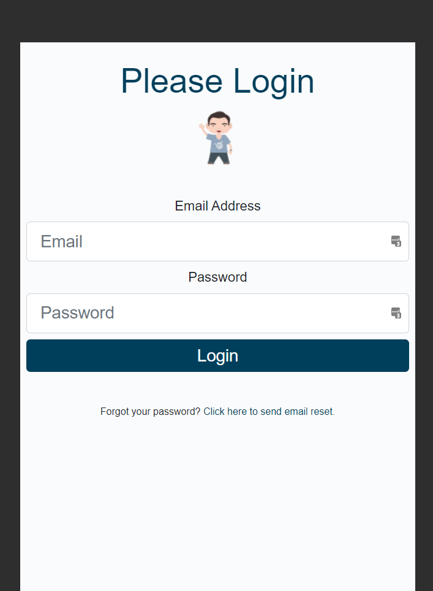
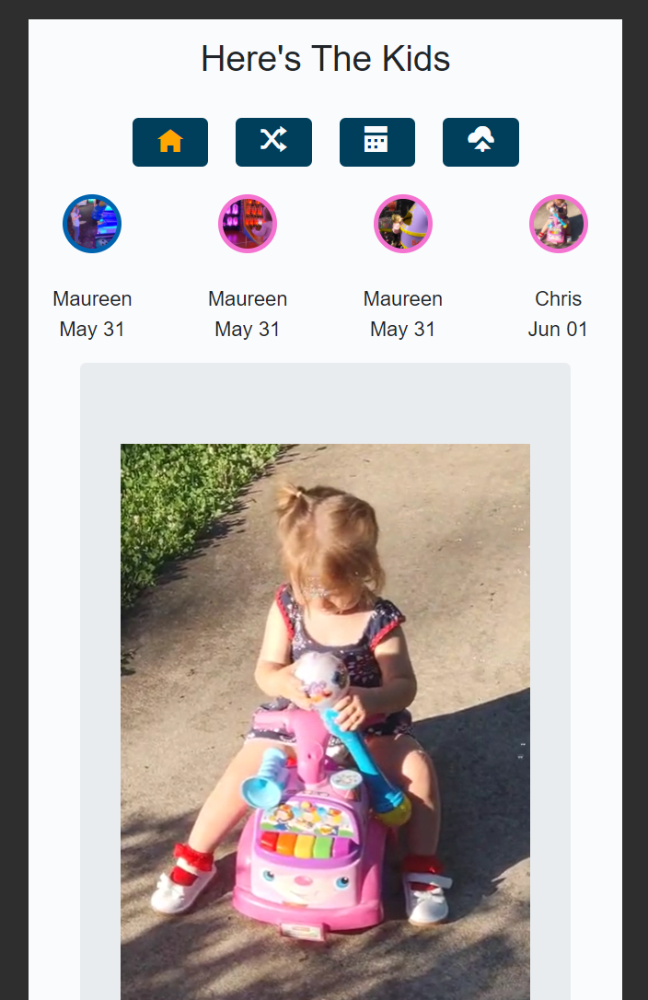
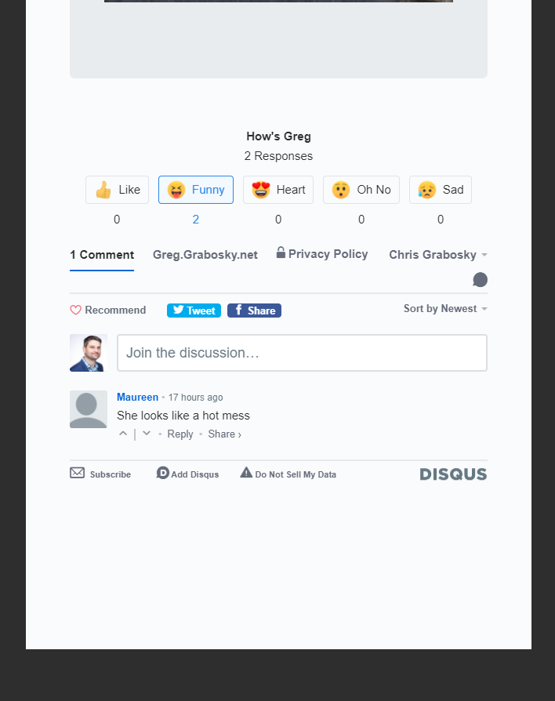
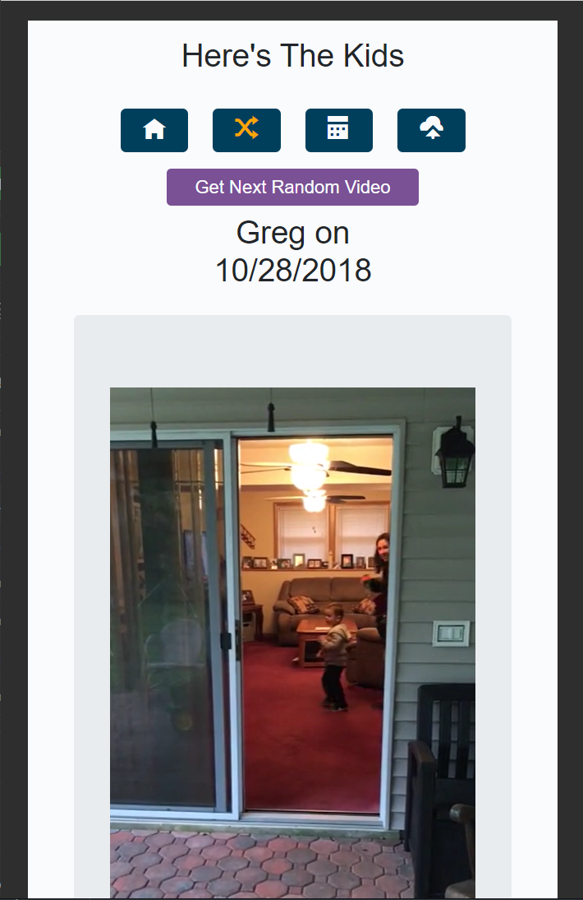
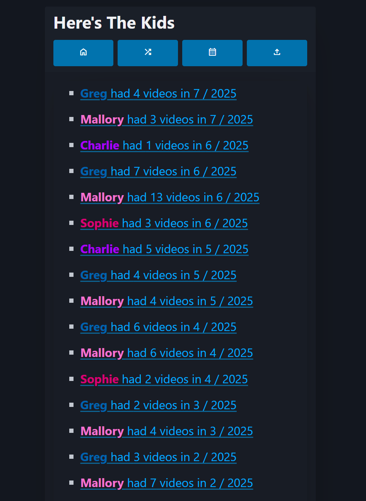
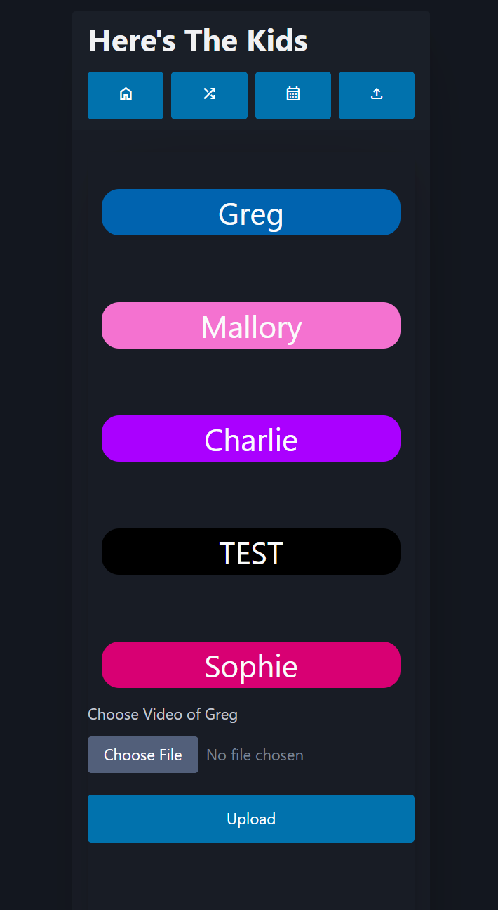

# README

This is a custom alternative now that Microsoft is killing Skype qik so we can no longer share videos of our baby with their grandparents. It is not very secure but instead meant as a basic way to stop people who randomly stumbled upon the site.

It was originally written on LAMP stack. It is now re-written in MongoDB and and Blazor Server.

## How do I get set up?

* Deploy a MongoDB server
* Run `./build.sh` to run locally
    * Note you need to copy `SAMPLE.env` to `.env` and fill in variables first
* To run one from docker hub, edit variables in `run.sh` and execute it
    * Note the volume mount points as ffmpeg must be manually downloaded and mounted
* To enable resize to smaller videos for better streaming, in root edit cron (`sudo crontab -e`) and enter `*/5 * * * * /Greg/www/ffmpeg/resize.sh` to resize videos to lower quality every 5 mins

## Features
* Push notifications via Twilio SMS
* media re-encoding in batch for better streaming
* responsive built on top of picocss for computers, tablets, and phones
* comments built on top of disqus
* ability to favorite videos
* view videos by most recent (home page), by day/year, favorite, etc
* user permissions for which users can see videos of which kids via ASP.NET Identity on top of [MongoDB](https://github.com/matteofabbri/AspNetCore.Identity.Mongo) and can be added via the `/NewUserCreation` route by anyone with the `ADMIN` claim

## Screenshots

