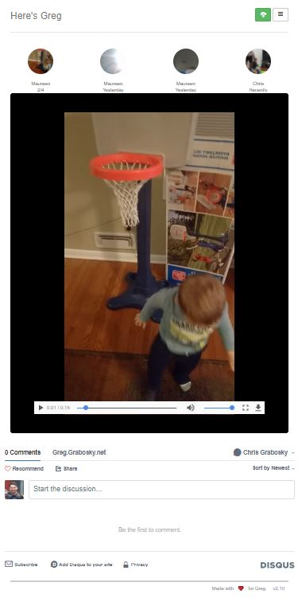

# README

This is a custom alternative now that Microsoft is killing Skype qik so we can no longer share videos of our baby with their grandmothers. It is not very secure but instead meant as a basic way to stop people who randomly stumbled upon the site.

## How do I get set up?

* Get a linux box and install docker
* Create a directory in / to store data, here called Greg
* `mkdir /Greg; mkdir /Greg/www; mkdir /Greg/db`
* extract this repo in /Greg/www
* extract the latest static build of ffmpeg into /Greg/www/ffmpeg, from here: https://johnvansickle.com/ffmpeg/builds/ffmpeg-git-32bit-static.tar.xz
* Run `docker run -d -p 80:80 -v /Greg/www:/var/www -v /Greg/db:/var/lib/mysql --name heresgreg btobolaski/lamp`
* Attach to the instance and import the DB schema called DBStructure.sql 
* `docker exec -i -t containerid /bin/bash`
* `mysql -u app -p app < /var/www/DBStructure.sql` and password is `app_password`
* Default username and passcode is `admin`
* navigate to your site on port 80 and should be all set
* For advanced features, edit includes/config.php and set the APPNAME to your child's name and create a pushbullet channel and API key and fill that out for push notifications
* note that a PHP.ini file is included in case the default does not work due to bad upload settings (size, temp folders, etc)

## Features
* Push notifications via pushbullet for new videos uploaded and weekly summary (this week in) from past years
* media re-encoding in batch for better streaming
* responsive built on top of bootstrap for computers, tablets, and phones
* comments built on top of disqus
* filter overlays for places and holidays
* upload videos and animated gifs
* ability to favorite videos
* view videos by most recent (home page), by day/year, favorite, filter, etc

## Screenshots
