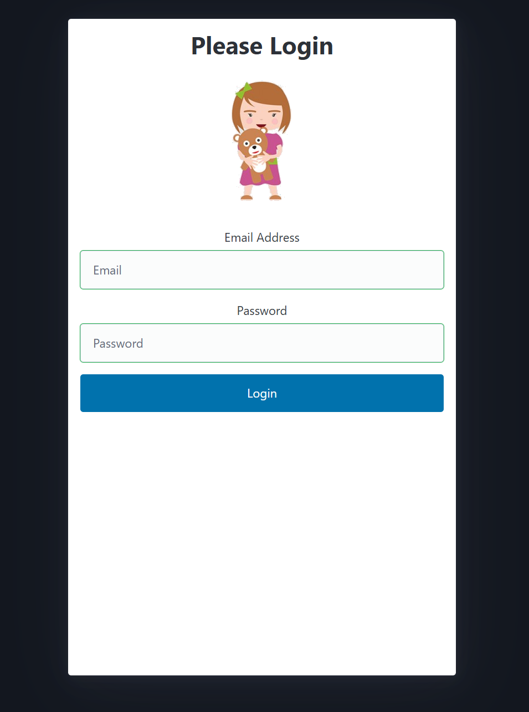
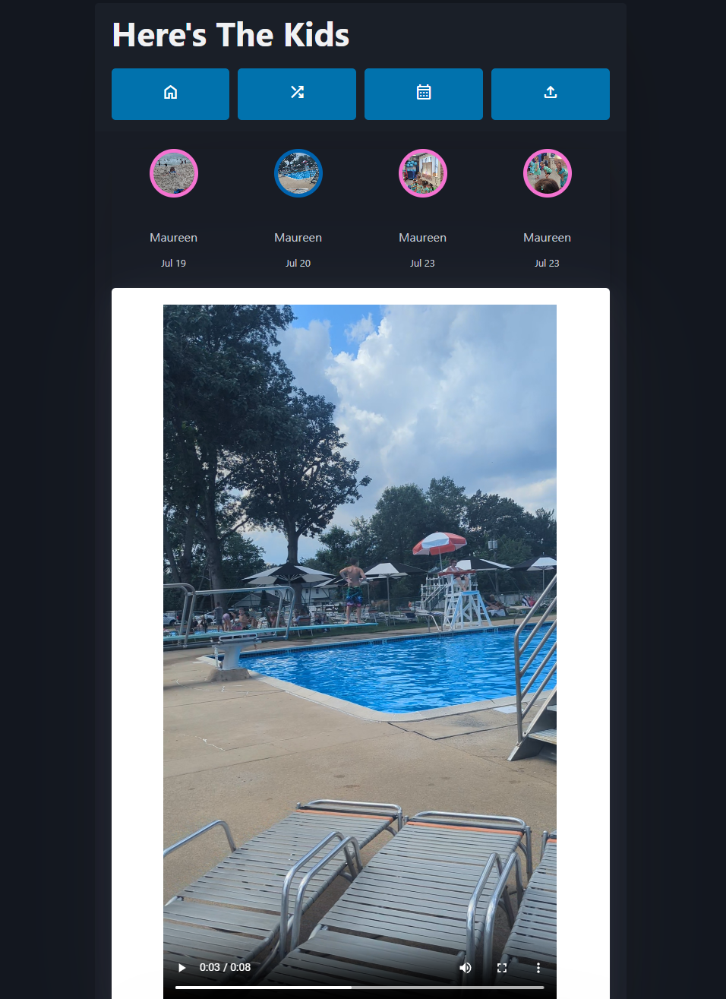
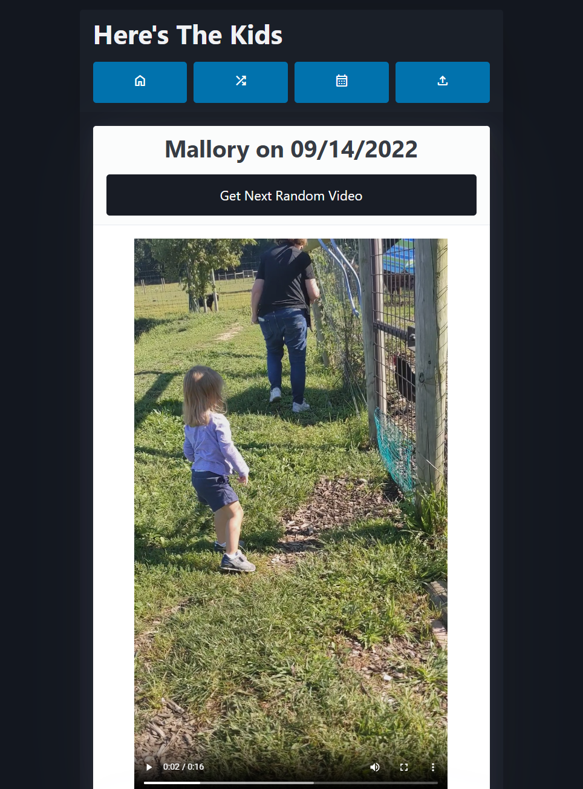
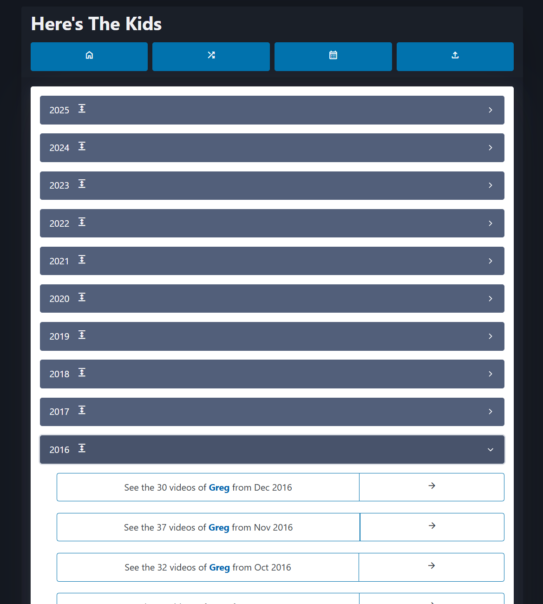

# README

This is a custom alternative now that Microsoft is killing Skype qik so we can no longer share videos of our baby with their grandmothers. It is not very secure but instead meant as a basic way to stop people who randomly stumbled upon the site.

It was written on LAMP stack. It is now being re-written in MongoDB, Realm, and Blazor.

## How do I get set up?

* Didn't update this section yet
* To enable resize to smaller videos for better streaming, in root edit cron (`sudo crontab -e`) and enter `*/5 * * * * /Greg/www/ffmpeg/resize.sh` to resize videos to lower quality every 5 mins

## Features
* Push notifications via Twilio SMS
* media re-encoding in batch for better streaming
* responsive built on top of bootstrap for computers, tablets, and phones
* comments built on top of disqus
* ability to favorite videos
* view videos by most recent (home page), by day/year, favorite, etc
* user permissions for which users can see videos of which kids

## Screenshots

